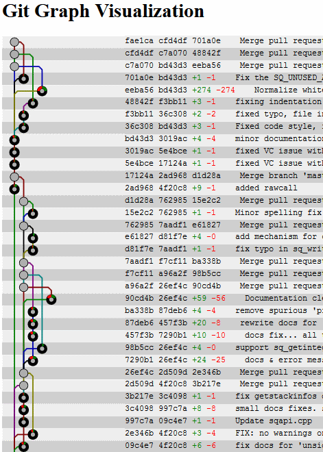

# GitGraph

A git revision graph renderer with SVG.

Try it now on your browser!

http://msakuta.github.io/gitgraph

## How to build

* Install [Rust](https://www.rust-lang.org/tools/install)
* Install [Node.js](https://nodejs.org/en/)
* `cargo build --release`
* Binary will be produced in `target/release`

## How to run development server

* `cargo run`
* `npm i`
* `npm start`
* Browse http://localhost:8084/

You can edit JS files and they will hot reload.
Be aware that Rust code won't reload.
